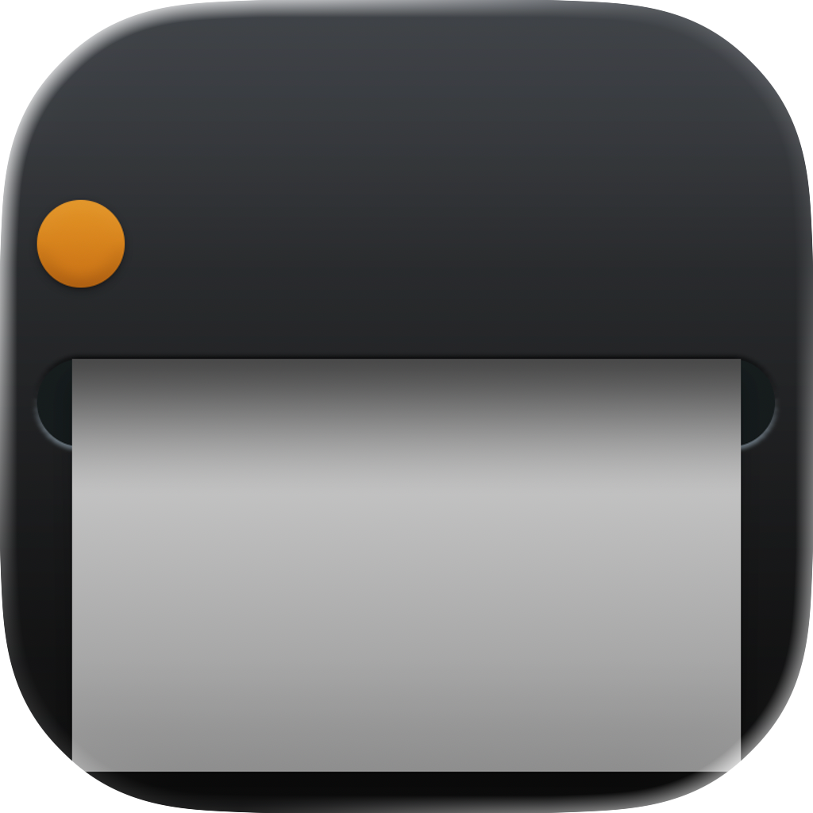
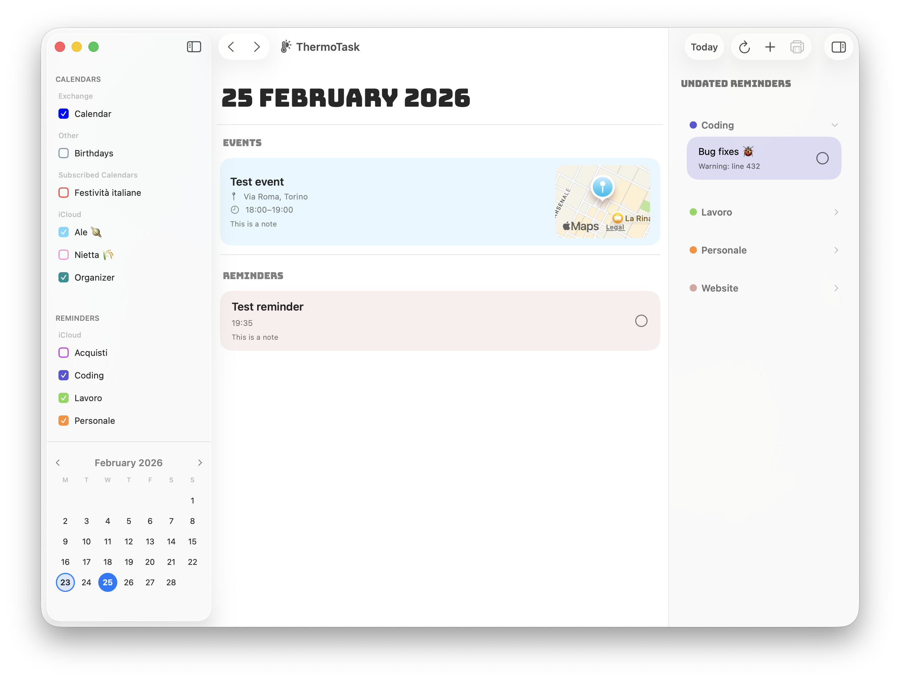

  
  <h1 align="center">ThermoTask</h1>
  

    <strong>A macOS app that brings your Apple Calendar events and Reminders together in one view — and lets you print them as retro-style thermal tickets on a <a href="https://www.niimbot.com/">Niimbot</a> label printer.</strong>
     
     
    
    
    
     
    <a href="#about">About</a>
    ·
    <a href="#demo">Demo</a>
    ·
    <a href="#features">Features</a>
    ·
    <a href="#installation">Installation</a>
    ·
    <a href="#getting-started">Getting Started</a>
     
    [ <a href="https://github.com/alefaraci/ThermoTask/releases/tag/v1.0.0">Download</a> ]
  

## About

**ThermoTask** is a macOS app that brings your Apple Calendar events and Reminders together in a unified daily view — and lets you print them as retro-style thermal tickets on a [Niimbot](https://www.niimbot.com/) Bluetooth label printer.

The app includes a built-in Swift implementation of the Niimbot BLE protocol (ported from [niimbluelib](https://github.com/MultiMote/niimbluelib)), enabling direct communication with the printer without any external runtime or Node.js dependency.

## Demo

## Features

| Feature | Description |
|---------|-------------|
| **Create, Edit & Delete** | Manage calendar events and reminders for any date side by side |
| **Thermal Ticket Rendering** | 384px-wide PNG tickets at 203 DPI with a retro receipt aesthetic |
| **Bulk Print** | Select multiple items and print them sequentially to a thermal printer |
| **Live Sync** | Automatically refreshes when the EventKit store changes |

## Installation

1. Download [`ThermoTask.dmg`](https://github.com/alefaraci/ThermoTask/releases/download/v1.0/ThermoTask.dmg) file;
2. Drag `ThermoTask.app` to `/Applications` folder;

> [!IMPORTANT]
> If you see a message that the app cannot be opened because it is from an unidentified developer, follow these steps:
>
> 1. Open `System Preferences` > `Security & Privacy Settings`;
> 2. Look towards the bottom of the window for a message saying: *"ThermoTask was blocked from use because it is not from an identified developer."*;
> 3. Click `Open Anyway` (you may need to enter your admin password);
> 4. Click on the `ThermoTask` icon again in Finder;
> 5. A confirmation dialog will appear — click `Open` to confirm.

### Requirements

- macOS 26.2+ (Tahoe)
- Xcode 26.2+
- A Niimbot Bluetooth label printer (only B1 series is supported) for printing features

## Getting Started

1. Clone the repository.
2. Open `ThermoTask.xcodeproj` in Xcode.
3. Build and run (Cmd+R).
4. Grant Calendar, Reminders, and Bluetooth permissions when prompted.

### Printing

The app communicates directly with Niimbot printers over Bluetooth Low Energy using a built-in Swift library (niimblue-swift).

### Setup

The printer address must be set in `PrintService.swift`. To use your own printer:

1. Find your printer's Bluetooth address (e.g. `B1-H11********`).
2. Update the `--address` argument in `PrintService.swift`.
3. Ensure Bluetooth is enabled and the printer is powered on.

> [!WARNING]
>
> This project is intended for informational and educational purposes only.
> The project is not affiliated with or endorsed by the original software or hardware vendor,
> and is not intended to be used for commercial purposes without the consent of the vendor.
> 
## Credits

- [niimbluelib](https://github.com/MultiMote/niimbluelib) for the open source implementation of the NIIMBOT printers protocol.
- App icon inspired from an original design by [Hugo](https://macosicons.com/#/u/Hugo) on [macOSicons](https://macosicons.com/).

## License

This project is licensed under the Apache License 2.0 - see the [LICENSE](LICENSE) file for details.